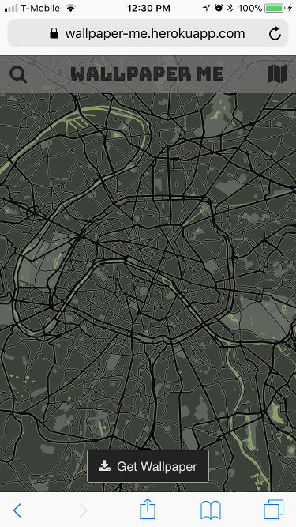
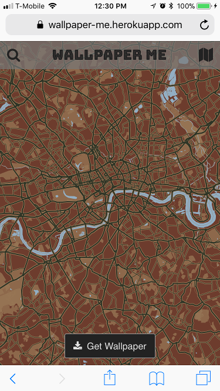
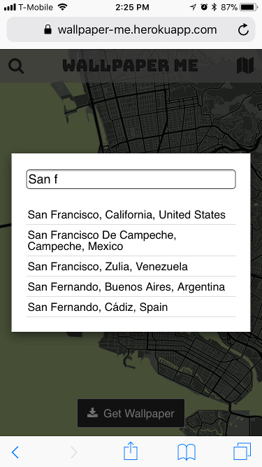
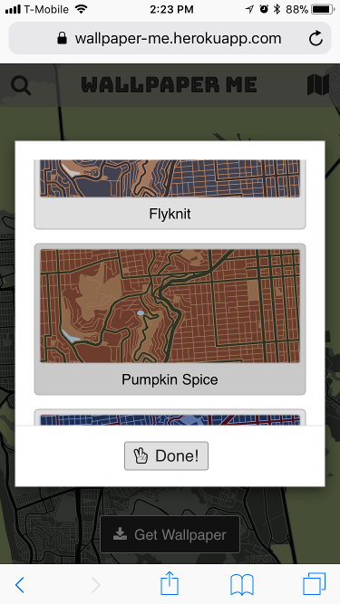
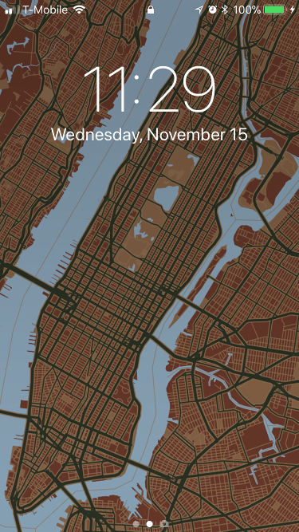
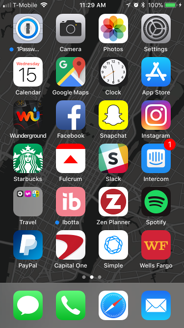
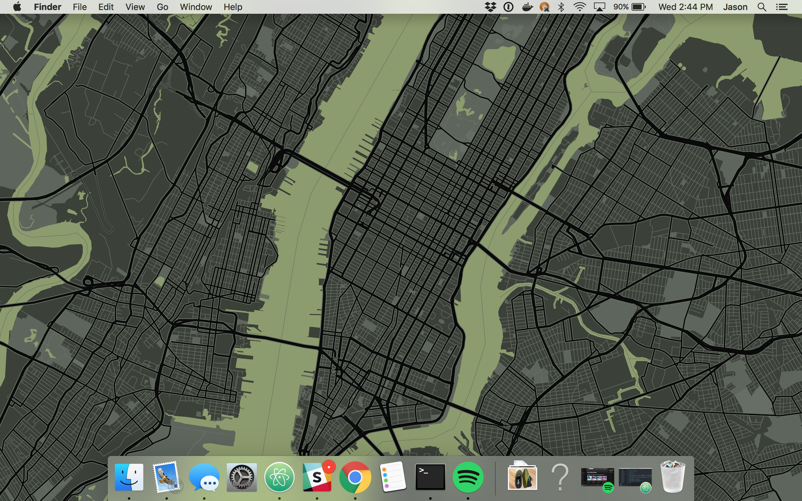

## Wallpaper Me

A web app for grabbing map images and stitching them together to create wallpapers for your phone, tablet, or laptop.

### The Web App

 

Search for places.

Select your map.

Then tap "Get Wallpaper" to open a new page where you can save your image to your device, then set as your wallpaper, lock screen, home screen, etc.

## In use

Colorful maps work well for lock screens while darker maps work better for home screens.

 

It works well for desktop backgrounds too.

